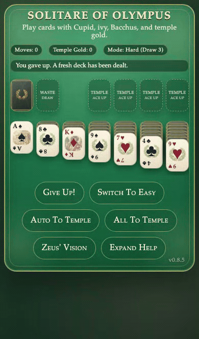

# Solitare of Olympus

Play cards with Cupid, ivy, Bacchus, and temple gold.

Plays in your phone's browser, with nothing to install.

## How to play

Draw from the stock and build the four temples from Ace to King, each built up by suit. Build the tableau down, alternating colors; only a King can start an empty column.

**Moving cards.** Tap or click a card to select it, then tap or click where it goes. Drag a card straight to its destination instead, and it flies there. Double-click or double-tap a waste or top tableau card to send it to a temple.

**Temple Gold.** A card that reaches a temple earns a gold. So does a waste card placed on the tableau. Rearranging the tableau earns nothing.

Once the stock is empty, tap or click it, now reading REDEAL, to recycle the waste into a new stock. Each recycle costs a gold; one that leaves you at zero ends the game.

**Buttons.**
- `Auto To Temple` sends one eligible card to a temple.
- `All To Temple` repeats that until no temple move remains.
- `Zeus' Vision` reveals every hidden card and ends the game.
- The game opens on Hard (draw 3); a new deal keeps your mode. Before your first move, `Switch To Easy` (draw 1) and `Switch To Hard` change it.
- `Give Up!` deals a fresh game at 0 gold; after a win it reads `Play Again` and keeps your gold.

**Keyboard.** `D` or `Enter` draws, `Space` sends one card to a temple, `A` sends every eligible card.

**Winning and losing.** Fill all four temples to King to win and keep your gold. A recycle that empties your gold, a board with no legal move, or Zeus' Vision ends the game.

## Features

- Drag any card.
- A phone-sized board and buttons.
- Mouse and keyboard play alongside touch.
- Cards fly to where they land, honoring `prefers-reduced-motion`.
- Temple gold carries from one win into the next game.

## About

Solitare of Olympus is Rust and Yew compiled to WebAssembly. Game logic lives in `src/game.rs`, pure Rust with host-run unit tests. This project is hosted at https://solitare.2ad.com.

## Run it locally

1. Install Rust and Trunk.
2. Add the wasm target:
   - `rustup target add wasm32-unknown-unknown`
3. Serve locally:
   - `trunk serve --release`
4. Open:
   - `http://127.0.0.1:8080`

### VS Code Dev Container

This repo includes a dev container setup:

- Dev container config: `.devcontainer/devcontainer.json`
- Dockerfile used by the container build: `Dockerfile`

Start steps:

1. Open the repo root in VS Code.
2. Run `Dev Containers: Reopen in Container`.
3. In the container terminal run `trunk serve --release`.
4. Open `http://127.0.0.1:8080`.

Deploy notes: [docs/DEPLOY.md](docs/DEPLOY.md).
